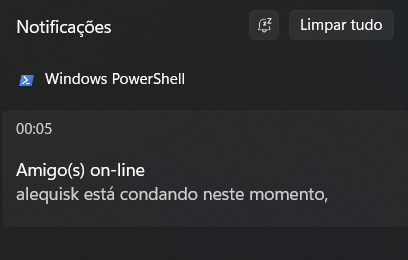

# Friends Codeforces Activity

FCA é um notificador de quando seus amigos estão submetendo problemas na plataforma codeforces. A ideia do *tracker* é conseguir ter noção de quão ativo seus companheiros estão em relação a programação competitiva, sendo assim você consegue ser notificado de quando novas submissões enquanto usa normalmente o computador.


# Como isso funciona?

O programa faz requisições para a [API do codeforces](https://codeforces.com/apiHelp) periodicamente dos handles de seus amigos e verifica se há mudança na lista de submissões mais recentes. Caso haja alguma nova submissão, o programa irá enviar uma mensagem de todos aqueles que estarão codando naquele intervalo de tempo. 

<p align="center">
  
</p>

# Comece a usar!

Para começar a usar o programa você deve ter Go instalado na versão [v1.21.1](https://go.dev/doc/install) ou superior.

Defina os handles que você deseja monitorar no arquivo `friends.go` no caminho `internal/domain/checker`.

```golang
  var (
    handles = []string{"amigo1", "amigo2", "amigo3"}  // você pode adicionar mais ou menos amigos
  )
```

Você também pode mudar o intervalo de cada nova checkagem no arquivo `cmd/main.go` alterando o valor da variável `period_for_check`.

Baixe as depedências do projeto rodando o seguinte comando no terminal:

```sh
  go mod tidy
```

Após isso compile o projeto para criar um executável standalone para rodar quando quiser:

```sh
  go build cmd/main.go
```

O comando irá gerar um binário com o nome *main* dentro da pasta do projeto e terá a extensão ".exe" apenas se você estiver no Windows. A forma de rodar o programa será dando dois cliques caso esteja na plataforma Windows e no Linux você pode abrir o terminal no caminho do projeto e digitar o comando `./main` que o programa irá começar a monitorar novas submissões.

## Limitações

Por conta da restrição da API do Codeforces para evitar ataques de DDoS, o programa é limitado de buscar submissões dos handles a cada 4 segundos, uma vez que o limite padrão da API é de 1 requisição a cada 2 segundos. Isso impede paralelismo nas chamadas e as fazendo demorar a checkagem caso a sua lista de amizade for muito grande.


## Sobre

Não sou especialista em Golang mas esse é um projeto simples que foi útil tanto para praticar quanto manter o uso constante já que são sutis as notificações e você não se atrapalha quando chega uma nova notificação, além do programa ser bastante pequeno (cerca de 10mb o arquivo binário) e de baixíssimo consumo de recurso. Em alguns testes ele chegou a um pico de 4.5mb de uso de RAM e abaixou após o Garbage Collector entrar em ação.

Qualquer sugestão ou melhorias no código podem ser feitas através de Pull Requests e estarei disposto a incorporar caso esteja de acordo com o intuito do programa.
